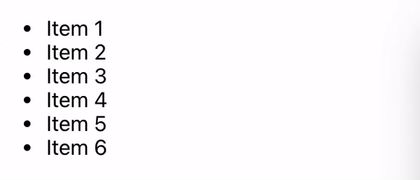

# react-sequential-list

Render items in a list one at a time while waiting for items to call an onComplete callback.
Useful for rendering lists of items that are expensive to render.

# Installation
`npm i react-sequential-list`

# Usage
```tsx
import React from 'react';
import SequentialList from 'react-sequential-list';

/** Generated a random integer within the inclusive range of start and end */
function randInt(start, end) {
  const range = end + 1 - start; 
  return Math.floor(Math.random() * range) + start;
}

/** An example ListItem 
 * @info onComplete will be inserted/overriden by SequentialList */
function ListItem({ text, onComplete }) {
  const [timeLeft, setTimeLeft] = React.useState(randInt(0, 7));

  // Simulating an async task and calling onComplete once resolved
  React.useEffect(() => {
    if (timeLeft > 0) {
      setTimeout(() => setTimeLeft(seconds => seconds - 1), 1000);
    } else {
      if (onComplete) {
        onComplete();
      }
    }
  }, [onComplete, timeLeft]);

  return <li>{text}{timeLeft > 0 && `, in progress (${timeLeft})`}</li>
}

function App() {
  return (
    <ul>
      <SequentialList>
        <ListItem text="Item 1" />
        <ListItem text="Item 2" />
        <ListItem text="Item 3" />
        <ListItem text="Item 4" />
        <ListItem text="Item 5" />
        <ListItem text="Item 6" />
      </SequentialList>
    </ul>
  );
}

export default App;

```

# Result
