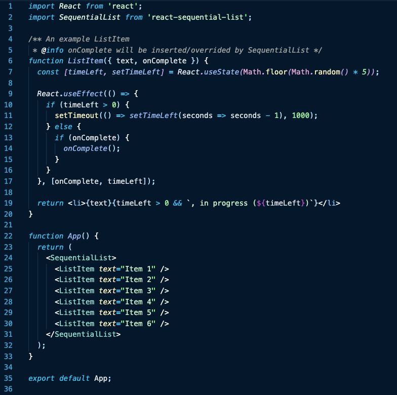

# react-sequential-list

Render items in a list one at a time while waiting for items to call an onComplete callback.
Useful for rendering lists of items that are expensive to render.

# Installation
`npm i react-sequential-list`

# Usage

# Result
